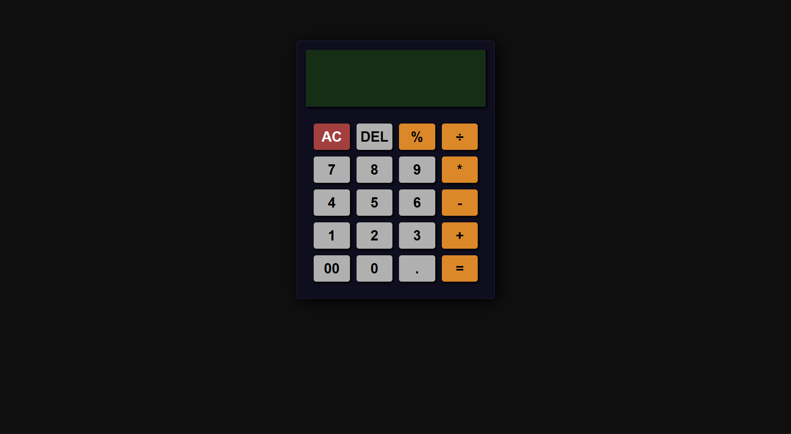

# 🧮 Simple Calculator Web App

A clean and responsive **calculator web app** built with **HTML, CSS, and JavaScript**.  
Supports mouse clicks and **keyboard input**, and handles all the basic math operations you’d expect from a standard calculator.

---

## 📸 Preview

> Replace `screenshot.png` with your actual image file name

---

## ✨ Features

- ➕➖✖️➗ **Basic arithmetic operations** – addition, subtraction, multiplication, division  
- 💯 **Percentage calculation**  
- ⌫ **DEL button** – delete the last entered character  
- 🧹 **AC button** – clear the entire display and reset the calculator  
- 🧾 **Full result on display** – shows complete expressions and results clearly  
- ⌨️ **Keyboard support** – perform calculations using your keyboard  
- 📐 **CSS Grid layout** – neat, structured, and easy-to-scan button layout  
- 🎨 **Clean, modern UI** – dark theme with clear contrast for buttons and display

---

## 🛠 Tech Stack

- **HTML5**
- **CSS3** (with **Grid** layout)
- **Vanilla JavaScript (ES6+)**

---